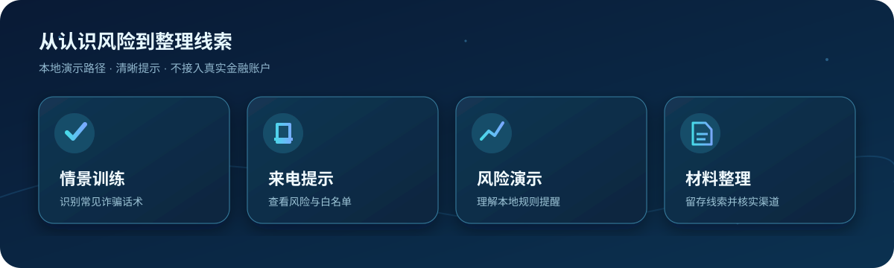
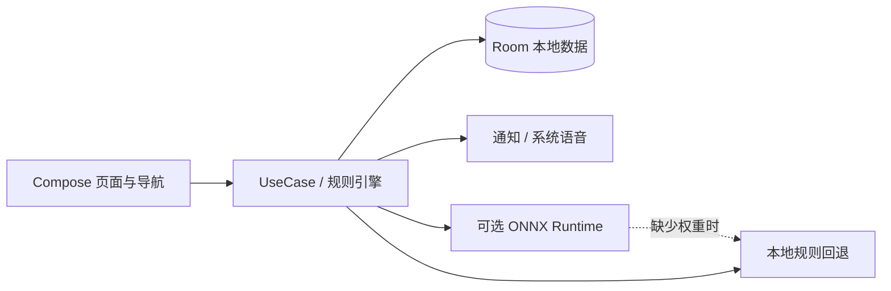

<div align="center">


# 银盾守护 · Silver Shield Guard

**为长者设计的反诈教育与风险提示 Android 原型**<br>
让诈骗话术更容易识别，让风险提示更容易看懂。

[](https://github.com/1828703450qqcom-ux/silver-shield-guard/actions/workflows/android-build.yml)


[功能概览](#功能概览) · [运行项目](#运行项目) · [实现状态](#实现状态) · [架构与目录](#架构与目录) · [部署指南](docs/部署与构建指南.md)

</div>

---

银盾守护用 **大字号、清晰反馈和简化路径** 展示反诈训练、来电风险提示与本地规则分析。代码采用 Kotlin、Jetpack Compose 和 Room。它是一份可构建的客户端原型，适合产品演示、适老化交互探索与 Android 技术学习。

> [!NOTE]
> 当前版本不连接银行、微信或支付宝，也不提供真实账户绑定、系统级来电拦截或官方报案提交。仓库未附带 ONNX 模型权重；有关能力边界请阅读[实现状态](docs/实现状态.md)。

## 功能概览



| 体验模块 | 已有内容 | 适合演示的场景 |
| :--- | :--- | :--- |
| 🧠 防骗训练 | 预置话术、训练会话、关键词提示、模拟积分 | 识别常见诈骗话术 |
| ☎️ 来电提示 | 本地号码风险查询、白名单及提示界面 | 解释风险等级与白名单 |
| 🛡️ 财务风险 | Room 示例交易、规则引擎、风险卡片 | 理解异常交易提示逻辑 |
| 🗂️ 线索整理 | 表单页面、案件页面、PDF 工具 | 梳理需要核实的材料 |
| 👨‍👩‍👧 家庭守护 | 家庭成员页面和本地结构 | 展示家属协助的交互构想 |

## 运行项目

准备 **JDK 17**、**Android SDK 34** 和 Android Studio。首次构建需要下载依赖。

```bash
git clone https://github.com/1828703450qqcom-ux/silver-shield-guard.git
cd silver-shield-guard
bash ./gradlew assembleDebug
```

Windows PowerShell 使用 `.\gradlew.bat assembleDebug`。生成的 APK 位于 `app/build/outputs/apk/debug/app-debug.apk`，可安装到 Android 8.0（API 26）及以上的测试设备。完整的 SDK 安装、设备调试、签名和排障步骤见[部署与构建指南](docs/部署与构建指南.md)。

## 实现状态

| 范围 | 当前状态 |
| :--- | :--- |
| 界面、导航与本地数据 | 主要页面、DAO、规则代码已在仓库；部分业务仍用演示数据 |
| 本地反诈训练与风险提示 | 可用于原型演示；尚缺少完整的效果评测 |
| ONNX 推理 | 有加载封装与回退路径，仓库没有模型文件或可信准确率报告 |
| 金融机构与支付平台接入 | 未接入；账户说明页不收集真实卡号、手机号或验证码 |
| 来电拦截、方言覆盖、远程家庭同步 | 未完成跨设备与真机端到端验证 |
| 官方报案、现金奖励 | 未接入；页面和积分均不代表官方受理或实际收益 |

早期[项目规划](PROJECT_PLAN.md)保留为产品构想，其中的性能、方言数量和机构协同目标并非当前交付能力。更详细的代码依据与后续工作见[实现状态说明](docs/实现状态.md)。

## 架构与目录



```text
app/src/main/java/com/yindun/shouhu/
├── ui/          Compose 页面、主题与导航
├── domain/      规则引擎和业务用例
├── data/        Room 数据库、DAO 与仓库
├── service/     通知及后台服务原型
└── util/        语音、PDF、加密和模型封装
docs/           部署指南、实现状态和插图
```

项目当前只有 Android 客户端，没有可部署的生产后端。

## 文档与协作

| 文档 | 用途 |
| :--- | :--- |
| [部署与构建指南](docs/部署与构建指南.md) | 环境准备、APK 构建、设备安装与排障 |
| [实现状态说明](docs/实现状态.md) | 区分已实现、演示数据与规划能力 |
| [模型接入说明](app/src/main/assets/models/README.md) | ONNX 模型的当前缺口与接入条件 |
| [参与贡献](CONTRIBUTING.md) | 代码提交、验证与数据安全约定 |

欢迎通过 Issue 提供可复现问题和适老化体验建议。当前仓库尚无独立开源许可证；公开可见不等于允许复制、分发或商用。

> [!IMPORTANT]
> 请勿使用真实银行卡号、支付密码、验证码或身份信息测试此原型。它不属于银行、支付平台或公安机关；遇到真实风险，应通过官方渠道核实，必要时拨打 96110 或报警。
