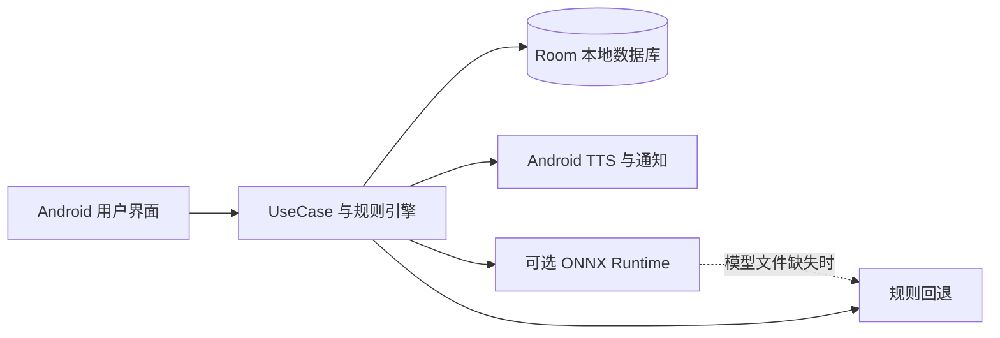

<div align="center">
  
  <h1>银盾守护 · 适老化反诈陪伴</h1>
  <p>用清晰的提示与容易练习的情景，让风险识别成为日常习惯。</p>
  <p>
    
    
    
  </p>
  <p><a href="#项目亮点">项目亮点</a> · <a href="#当前实现状态">实现状态</a> · <a href="#快速构建">快速构建</a> · <a href="docs/部署与构建指南.md">部署指南</a></p>
</div>

---

银盾守护是面向老年用户的 **Android 反诈教育与风险提示原型**。项目采用 Jetpack Compose 构建适老化界面，用 Room 保存本地示例数据，包含情景训练、来电风险提示、交易规则分析、举报材料与家庭守护等模块。它不是银行、支付平台或公安机关的官方应用。

> [!IMPORTANT]
> 本仓库提供原型源码和演示数据。当前没有接入银行、微信或支付宝的真实交易接口；没有随仓库发布 ONNX 模型权重，也没有验证“识别准确率”“支持 128 种方言”等历史文档中的指标。来电提示不等于系统级拦截，举报页面不等于已向公安机关报案。遇到真实风险，请通过官方渠道核实，必要时拨打 96110 或报警。

## 项目亮点

| 场景 | 仓库中的设计与实现 |
|---|---|
| 适老化交互 | 大字号、高对比度、简化导航、语音提示的界面设计 |
| 防骗训练 | 预置话术、训练页面、关键词提示与应用内模拟奖励 |
| 本地风险分析 | 规则引擎、Room 交易记录与后台检查服务 |
| 来电提醒 | 本地风险号码查询、白名单和通知提示代码 |
| 证据整理 | 举报表单、案件页面与 PDF 生成工具 |
| 隐私基础 | Android Keystore 加密工具、本地数据存储 |

## 当前实现状态

| 能力 | 状态与边界 |
|---|---|
| Android 界面与本地数据库 | 已有主要页面、实体、DAO 和仓库代码；部分按钮仍是占位实现 |
| 防骗话术与规则分析 | 已有预置脚本及规则逻辑，可用于原型演示 |
| ONNX 推理 | 已有加载与回退代码；模型文件尚未提供，运行时使用规则路径 |
| 银行/支付实时流水 | 尚未对接真实金融机构；界面中的账户和交易为本地演示数据 |
| 来电自动拦截与方言识别 | 尚未完成端到端验证，效果受 Android 版本、设备权限和系统语音服务限制 |
| 真实报案、家庭远程同步、现金奖励 | 尚未接入外部服务；相关页面与文案仅用于功能原型 |

详细的代码依据与待办见[实现状态说明](docs/实现状态.md)。项目规划文档中的目标功能不应当作当前已交付能力。

## 系统架构



项目是 **Android 客户端**，当前没有可部署的生产后端。根目录 `app/src/main/java/com/yindun/shouhu/` 按 `ui/`、`domain/`、`data/`、`service/`、`util/` 分层；`app/src/main/assets/` 保存预置话术和模型说明。

## 快速构建

准备 JDK 17、Android SDK 34 和 Android Studio。克隆后在项目根目录运行：

```powershell
.\gradlew.bat assembleDebug
# APK: app\build\outputs\apk\debug\app-debug.apk
```

macOS/Linux 使用 `./gradlew assembleDebug`。首次运行会下载 Gradle 和 Android 依赖；Android Studio 可直接打开根目录并等待同步。SDK 安装、调试安装、签名、常见问题和权限说明见[部署与构建指南](docs/部署与构建指南.md)。

## 文档导航

| 文档 | 内容 |
|---|---|
| [部署与构建指南](docs/部署与构建指南.md) | 环境、APK 构建、设备安装、发布签名与排障 |
| [实现状态说明](docs/实现状态.md) | 已有代码、演示数据、未接入能力与验证范围 |
| [项目规划](PROJECT_PLAN.md) | 早期产品构想，非当前交付清单 |
| [模型接入说明](app/src/main/assets/models/README.md) | 可选 ONNX 模型的预期接口与当前缺口 |

## 数据与许可

不要使用真实银行卡号、验证码或身份信息测试原型；也不要将调试 APK 用于真实财务决策。公开仓库不包含签名密钥、本机 SDK 配置、构建缓存、崩溃日志或原始商业计划书。仓库目前没有独立的开源许可证文件；公开可见不等于获得复制、分发或商用许可。

